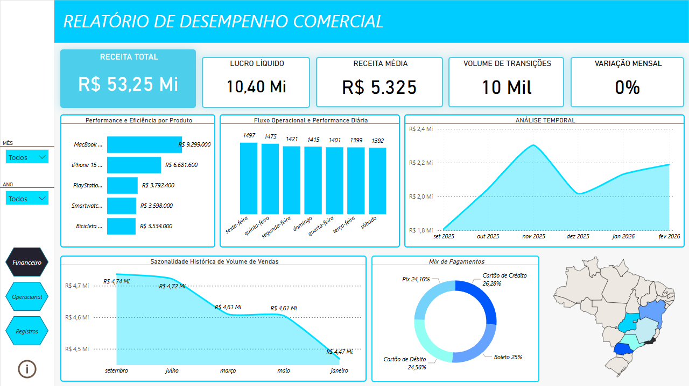
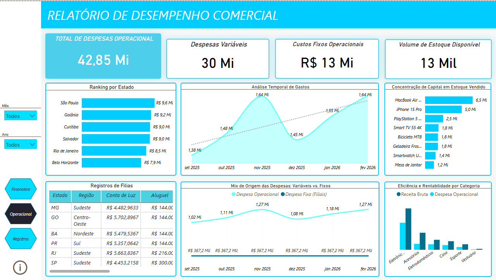
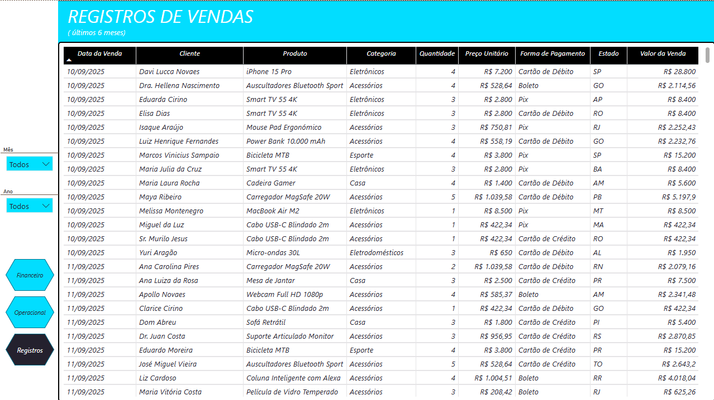

🚀 Sistema Jotta: Arquitetura de BI e Engenharia de Dados:

Este projeto apresenta uma solução completa de dados, desde a modelagem de banco de dados relacional e ingestão automatizada até a entrega de dashboards executivos de alta fidelidade. O foco principal foi a resolução de inconsistências financeiras e a entrega de KPIs de rentabilidade real.

🛠️ Tecnologias Utilizadas
Banco de Dados: 

Supabase (PostgreSQL)

Linguagem: 

Python (Pandas, SQLAlchemy)

Visualização: 

Power BI (DAX, Star Schema)

Automação: 

Scripts de Carga Massiva

Infraestrutura e Engenharia (Back-end)
Aqui está a explicação técnica de cada script desenvolvido no projeto:

1. 
Função:

Define a arquitetura das tabelas (Produtos, Filiais, Vendas) no Supabase.

Destaque Técnico: 

Implementação de chaves primárias e estrangeiras para garantir a integridade referencial, permitindo que o Power BI identifique os relacionamentos automaticamente.

2. 
Função:

Script Python responsável por alimentar as tabelas dimensionais (Produtos e Filiais).

Destaque Técnico: 

Garante que cada produto tenha atributos específicos (preço, categoria) e cada filial tenha seus custos fixos (aluguel, manutenção) devidamente registrados para o cálculo de margem posterior.

3. 

Função: 

O "cérebro" da operação. Integra as regras de negócio das métricas de e-commerce com o fluxo de vendas presenciais.

Destaque Técnico: 
Cálculo dinâmico de impostos e taxas de entrega antes da carga no banco de dados.

4. 
Função:

Script de estresse para povoar o banco com milhares de transações reais.

Destaque Técnico: 

Foi através deste script que geramos os R$ 53,25 Milhões em faturamento, provando que a solução é escalável para grandes volumes de dados.

📊 Demonstração Visual (Dashboards)

Nesta seção, apresento os resultados finais consolidados no Power BI, fruto da integração entre o banco de dados Supabase e os scripts Python de carga massiva.

1. 

Foco no monitoramento de KPIs macro: Receita Bruta, Volume de Transações e Lucro Líquido consolidado.

2. 

Análise de custos fixos vs. variáveis, ranking de rentabilidade por estado e eficiência por categoria de produto.

3. 

Visão granular dos dados, exibindo a integridade de cada registro transacional processado pelo sistema.
